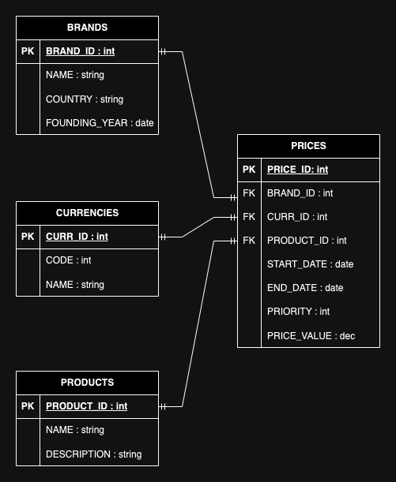

<br>

# [Inditex Test](https://github.com/franmastucci/inditex)
#### Price retrieval service in a testing context for the company Inditex.
#### Author: [Francisco Mastucci Silva](https://www.linkedin.com/in/franmastucci/).
<br>

### API Quickstart
#### ⚠ Warning: Docker is required for the execution of integration tests via Testcontainers.

```bash
mvn clean install
```
<br>


### API Endpoints
| Path                                                        | Type | Description                                                 |
|:------------------------------------------------------------|:-----|:------------------------------------------------------------|
| /prices?product={product_id}&brand={brand_name}&date={date} | GET  | Retrieves prices for a specific product and brand at a given date and time |
#### Invoking the Price service:
```curl
curl --location 'http://localhost:8080/prices?product=35455&brand=ZARA&date=2020-06-16%2021:00:00'
```

<br>


### ER Diagram



<br>

### Technology
* **Platform:** Java 11
* **Project type:** Microservice
* **Spring Boot version:** 2.7.5
  <br><br>
